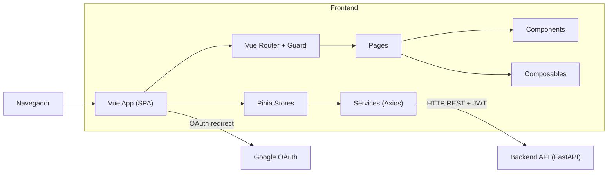

# Arquitetura — MentorIA (Frontend)

## Visão Geral

SPA (Single Page Application) responsável pela interface do MentorIA. Gerencia o fluxo de autenticação via Google OAuth, onboarding do perfil profissional, e a visualização/gestão dos planos de desenvolvimento gerados pela IA. Comunica-se com o backend via REST com autenticação JWT.

> Arquitetura do backend: [`backend/docs/ARCHITECTURE.md`](../../backend/docs/ARCHITECTURE.md)

---

## Stack

| Tecnologia | Versão | Função |
|---|---|---|
| Vue 3 | ^3.5 | Framework (Composition API + `<script setup>`) |
| TypeScript | ~5.9 | Linguagem |
| PrimeVue | ^4.5 | Componentes UI (tema Aura) |
| Tailwind CSS | ^4.2 | Utilitários CSS |
| Pinia | ^3.0 | State management |
| Vue Router | ^5.0 | SPA routing |
| Axios | ^1.13 | HTTP client |
| Lucide Vue Next | — | Ícones |
| PrimeIcons | ^7.0 | Ícones PrimeVue |
| Vite | ^7.3 | Build tool |
| npm-run-all2 | — | Orquestração de scripts de build |

---

## Estrutura de Pastas/Arquivos

```
frontend/src/
├── App.vue                    # Root: Toast, ConfirmDialog, RouterView
├── main.ts                    # Bootstrap: Pinia, PrimeVue (tema Aura), Router
├── router/index.ts            # Rotas + navigation guard (JWT)
│
├── pages/                     # Páginas (1 por rota)
│   ├── LoginPage.vue
│   ├── AuthCallbackPage.vue
│   ├── OnboardingPage.vue
│   ├── LoadingAIPage.vue
│   ├── HomePage.vue
│   └── PlanDetailPage.vue
│
├── components/
│   ├── auth/                  # GoogleLoginButton
│   ├── onboarding/            # StepTrajetoria, StepFormacao, StepHabilidades, StepObjetivo, StepRevisao
│   ├── home/                  # EmptyState, PlanCard, PlanList
│   └── plan/                  # ActionItem, ActionTimeline, GapsList, PlanHeader, ProgressCard
│
├── composables/
│   └── useOnboarding.ts       # Lógica reativa do wizard de onboarding
│
├── layouts/
│   └── DefaultLayout.vue      # Header (logo + logout) e slot para conteúdo
│
├── services/                  # Camada HTTP (Axios)
│   ├── api.ts                 # Instância Axios (baseURL, interceptors JWT/401)
│   ├── authService.ts         # loginWithGoogle(), logout()
│   ├── planService.ts         # CRUD planos e ações
│   └── profileService.ts     # get/save perfil
│
├── stores/                    # Pinia stores
│   ├── authStore.ts           # Token, autenticação, login/logout
│   ├── plansStore.ts          # Lista planos, plano atual, ações
│   └── profileStore.ts       # Perfil do usuário
│
├── types/                     # TypeScript types (alinhados com backend schemas)
│   ├── index.ts               # Re-exports
│   ├── user.ts                # User, TokenResponse
│   ├── profile.ts             # Seniority, EducationLevel, CareerGoal, ProfileData/Out
│   └── plan.ts                # ActionStatus, Priority, Plan, Action, Gap
│
└── assets/
    └── main.css               # Estilos globais + Tailwind
```

---

## Rotas

| Rota | Página | Auth | Descrição |
|---|---|---|---|
| `/` | LoginPage | Não | Login com Google |
| `/auth/callback` | AuthCallbackPage | Não | Recebe token do OAuth callback |
| `/onboarding` | OnboardingPage | Sim | Wizard de perfil (5 etapas) |
| `/loading` | LoadingAIPage | Sim | Tela de loading durante geração do plano |
| `/home` | HomePage | Sim | Lista de planos do usuário |
| `/plan/:id` | PlanDetailPage | Sim | Detalhe do plano com ações e gaps |

### Navigation Guard

- Rotas públicas: `/` e `/auth/callback`
- Rotas protegidas: todas as demais (requer token no localStorage)
- Se autenticado e acessa `/` → redireciona para `/home`

---

## Diagrama de Conexões


